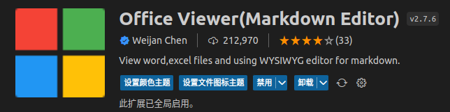
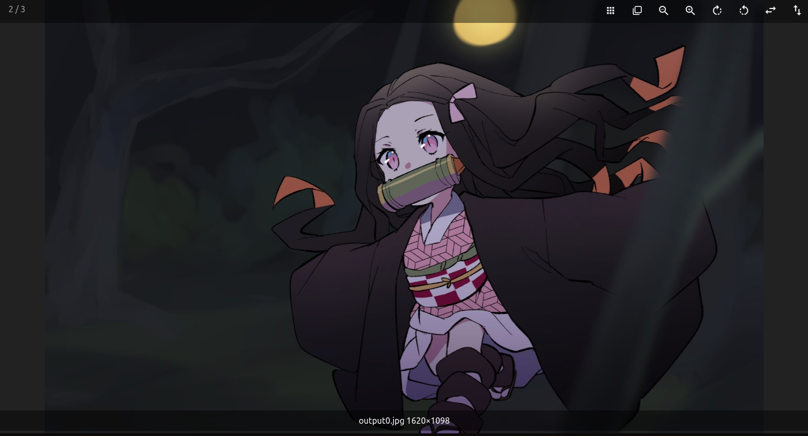
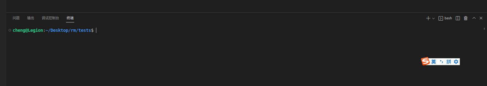

# C++ 学习测试题
## 编程环境配置
- **ubuntu**
- **vscode**
  - 建议在做本次练习时下载插件：`Office Viewer`
	  - 
    - 该插件可以让你在 `vscode` 中更加方面地查看 word, excel, 图片等文件，其中图片可以显示其像素数量，如下图
      - 
- **cmake, make , g++**
  - 安装方法如下，在终端中输入
  ```shell
  	sudo apt install cmake make g++ gcc
  ```
  - **g++**：c++编译器
  - **cmake, make**：c++编译多个文件的项目时需要的工具

## 如何编译运行该项目
在vscode中打开终端（ctrl + ~）

输入以下命令
```shell
# 创建一个文件夹 build，之后的编译过程中生成的文件都将存放在这里
mkdir build

# 进入 build 文件夹
cd build

# 编译
cmake ..
make -j6

# 运行
./tjurm-test
```

## 练习内容简介
- 文件 `include/tests.h`中，声明了 6 个函数，本次练习内容就是去用C++复现这 6 个函数的基本功能：
  - 前三个函数是 c-string 的库函数
  - 后三个是图形处理中的三个常用函数
- 文件 `src/tests.cpp`中，是这6个函数的待你完成的实现部分

## TODO你要做的
- 你需要对文件 `src/tests.cpp`中这6个函数分别完成以下步骤:
  1. 阅读我们写好的注释部分，理解函数的功能以及如何去实现
  2. 在每个函数的 `// IMPLEMENT YOUR CODE HERE` 下面去用C++完成该函数
  3. 编译运行该项目，根据终端的输出提示判断自己的测试样例是否通过

## PS
可以通过修改 `main.cpp` 中的 `main()`函数，逐个解决这6道练习题
比如当你想只测试 任务1 `my_strlen` 时，可以将 `main()` 改为：
```c++
int main() {
	std::cout << "开始测试函数 << my_strlen >> ..." << std::endl;
	test_strlen();
return 0;
}
```
然后再编译运行
